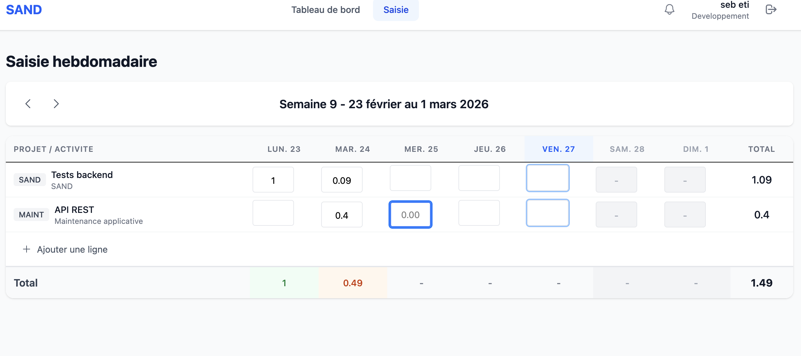
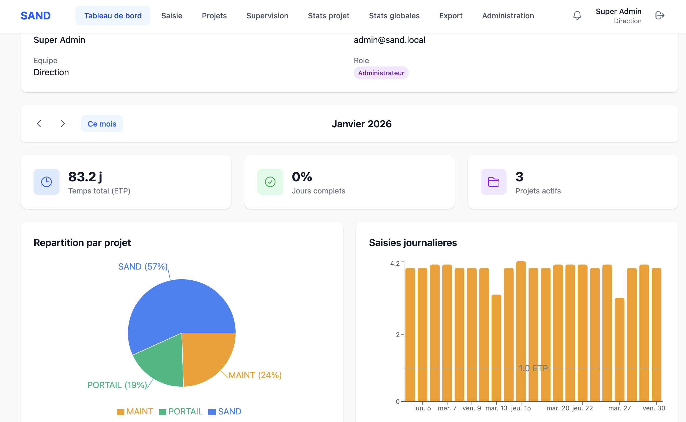
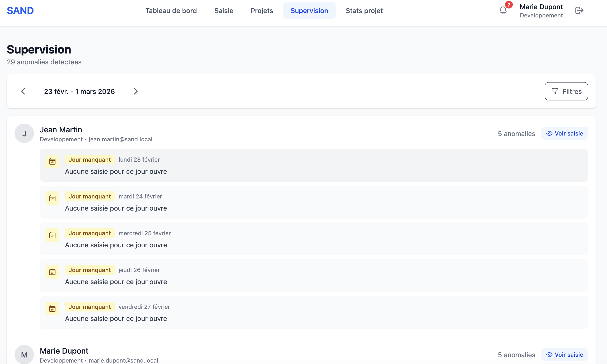
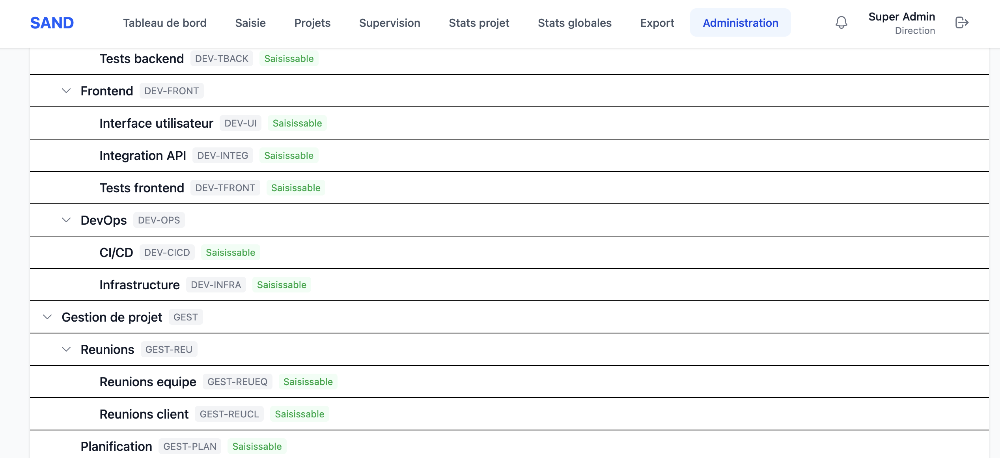

<div align="center">
  
</div>

# SAND — Saisie d'Activité Numérique Déclarative

Application web de saisie d'activités professionnelles. Les collaborateurs déclarent leur temps de travail par projet et activité (en ETP). Les modérateurs supervisent leur équipe, les admins configurent le système.

## Environnements

### Production

L'application est déployée en production à cette adresse : **https://sand.interstice.work**

### Développement local

L'environnement de développement par défaut est **local/natif** :

- Frontend : `http://localhost:5173`
- Backend Laravel : `http://localhost:8080`
- GraphQL : `http://localhost:8080/graphql`
- GraphiQL : `http://localhost:8080/graphiql`
- Mock API RH : `http://localhost:3001`

Un environnement **Docker** reste disponible en alternative pour les tests et les workflows conteneurisés.

Des données de démonstration (janvier 2026) sont préchargées. Trois comptes de test sont disponibles :

| Rôle | Email | Mot de passe |
|------|-------|--------------|
| Admin | admin@sand.local | password |
| Modérateur | marie.dupont@sand.local | password |
| Utilisateur | jean.martin@sand.local | password |

## Table des matières

- [Aperçu](#aperçu)
- [Stack technique](#stack-technique)
- [Prérequis](#prérequis)
- [Installation](#installation)
- [Mise à jour](#mise-à-jour)
- [Accès](#accès)
- [Configuration mail](#configuration-mail)
- [Commandes de développement](#commandes-de-développement)
- [Tests](#tests)
- [Troubleshooting](#troubleshooting)
- [Documentation](#documentation)

---

## Aperçu

### Saisie hebdomadaire

Déclaration du temps par projet et activité (en ETP), semaine par semaine. Les modérateurs peuvent saisir à la place d'un membre de leur équipe.



### Tableau de bord admin

Vue agrégée des ETP par projet et par jour pour toute l'organisation, avec répartition par activité.



### Supervision

Détection automatique des anomalies de saisie (jours incomplets ou manquants) pour le suivi de l'équipe.



### Arborescence des activités

Configuration de la hiérarchie des activités par codes métier. Seules les feuilles de l'arbre sont saisissables.



---

## Stack technique

| Couche | Technologies |
|--------|-------------|
| Backend | Laravel 12 · PHP 8.4 · Lighthouse 6 (GraphQL) · Sanctum |
| Frontend | React 19 · TypeScript · Apollo Client 4 · Tailwind CSS · Zustand |
| Base de données | PostgreSQL 16 (extension ltree) |
| Cache / Queue | Redis 7 |
| Conteneurisation | Docker · Docker Compose |
| Tests | PHPUnit (262 tests) · Vitest (235 tests) · Playwright (E2E) |

---

## Prérequis

### Développement local natif

- **PHP 8.4**
- **Composer**
- **Node.js ≥ 20**
- **PostgreSQL 16**
- **Redis**
- **Git**

Sur macOS, PostgreSQL et Redis peuvent tourner via Homebrew.

### Alternative Docker

- **Docker Desktop** — [docs.docker.com/get-docker](https://docs.docker.com/get-docker/)
- **Git**
- **Node.js ≥ 18** — uniquement pour les tests E2E Playwright sur l'hôte

> **macOS avec Homebrew** : `brew install --cask docker` pour installer Docker Desktop.

---

## Installation

### Développement local natif (recommandé)

```bash
git clone <url-du-repo>
cd sand

cp backend/.env.example backend/.env

brew services start redis
cd backend && php artisan serve --host=0.0.0.0 --port=8080 > /tmp/sand-backend.log 2>&1 &
cd ../frontend && npm install && npm run dev > /tmp/sand-frontend.log 2>&1 &
```

Points importants du `backend/.env` local :

```env
DB_HOST=127.0.0.1
REDIS_CLIENT=predis
REDIS_HOST=127.0.0.1
CACHE_STORE=redis
```

> `CACHE_STORE=redis` doit rester sur Redis pour que `Cache::tags()` fonctionne.

### Alternative Docker

```bash
git clone <url-du-repo>
cd sand

bash scripts/install.sh
```

Le script gère le démarrage Docker, la configuration, les migrations et les données de base.

Pour charger des données de démonstration réalistes (491 saisies, 3 projets, 30 activités, 3 absences) :

```bash
bash scripts/install.sh --demo
```

### Installation manuelle Docker (si le script ne convient pas)

```bash
# 1. Copier la configuration
cp backend/.env.example backend/.env
# Optionnel : passer APP_DEBUG=true dans backend/.env pour voir les erreurs Laravel
# Éditer backend/.env si nécessaire (mail, clés API...)

# 2. Démarrer les conteneurs
docker compose up -d --build

# 3. Installer les dépendances PHP
docker compose exec app composer install

# 4. Générer la clé d'application
docker compose exec app php artisan key:generate

# 5. Migrations et données de base
docker compose exec app php artisan migrate
docker compose exec app php artisan db:seed

# (optionnel) Données de démo
docker compose exec app php artisan db:seed --class=DemoSeeder
```

---

## Mise à jour

Après un `git pull` :

```bash
# Développement local natif
cd backend && php artisan migrate
cd ../frontend && npm run generate

# Si le schéma GraphQL a changé
cd ../backend && php artisan lighthouse:clear-cache
php artisan config:clear
```

Alternative Docker :

```bash
docker compose up -d --build
docker compose exec app php artisan migrate
docker compose exec app php artisan lighthouse:clear-cache
docker compose exec app php artisan config:clear
docker compose exec frontend npm run generate
```

---

## Accès

| Service | URL |
|---------|-----|
| Application | http://localhost:5173 |
| API GraphQL | http://localhost:8080/graphql |
| GraphiQL (playground) | http://localhost:8080/graphiql |
| Mock API RH | http://localhost:3001 |

### Comptes de test (mot de passe : `password`)

| Rôle | Email |
|------|-------|
| Admin | admin@sand.local |
| Modérateur | marie.dupont@sand.local |
| Utilisateur | jean.martin@sand.local |

---

## Configuration mail

Par défaut (`MAIL_MAILER=log`), les emails sont écrits dans les logs et non envoyés.

Pour recevoir de vrais emails en développement, configurer [Mailtrap](https://mailtrap.io) dans `backend/.env` :

```env
MAIL_MAILER=smtp
MAIL_HOST=sandbox.smtp.mailtrap.io
MAIL_PORT=2525
MAIL_USERNAME=<votre-username-mailtrap>
MAIL_PASSWORD=<votre-password-mailtrap>
```

Voir `backend/.env.example` pour la documentation complète des options.

---

## Commandes de développement

### Dev local natif

```bash
# Backend
cd backend
php artisan serve --host=0.0.0.0 --port=8080

# Frontend
cd frontend
npm run dev

# Cache GraphQL
cd backend
php artisan lighthouse:clear-cache
php artisan config:clear
```

### Docker

```bash
docker compose up -d          # Démarrer en arrière-plan
docker compose down           # Arrêter
docker compose logs -f        # Logs en temps réel
docker compose logs -f app    # Logs d'un seul service (app, nginx, db, redis, frontend)
docker compose exec app bash  # Shell dans le conteneur PHP
```

### Backend Laravel

```bash
# Migrations
cd backend && php artisan migrate
cd backend && php artisan migrate:fresh --seed

# Cache (obligatoire après modification du schéma GraphQL)
cd backend && php artisan lighthouse:clear-cache
cd backend && php artisan config:clear

# Linting PHP
cd backend && ./vendor/bin/pint

# Analyse statique (niveau 5)
cd backend && ./vendor/bin/phpstan analyse

# Tinker (REPL Laravel)
cd backend && php artisan tinker
```

Alternative Docker : préfixer avec `docker compose exec app`.

### Frontend

```bash
# Régénérer les types TypeScript depuis le schéma GraphQL
cd frontend && npm run generate

# Linting TypeScript/React
cd frontend && npm run lint

# Build de production
cd frontend && npm run build
```

Alternative Docker : préfixer avec `docker compose exec frontend`.

---

## Tests

### Backend (PHPUnit)

```bash
# Tous les tests
cd backend && php artisan test

# Un fichier spécifique
cd backend && php artisan test tests/Feature/AuthGraphQLTest.php

# Un test par nom
cd backend && php artisan test --filter test_login_avec_identifiants_valides
```

> La base de test `sand_test` est requise (PostgreSQL — ltree incompatible avec SQLite).
> En mode Docker, elle est créée automatiquement par le script `scripts/install.sh`.

### Frontend (Vitest)

```bash
# Mode watch (développement)
cd frontend && npm run test

# Une seule passe (CI)
cd frontend && npm run test:run

# Un fichier spécifique
cd frontend && npm run test -- src/hooks/__tests__/useSaisieHebdo.test.ts
```

### E2E (Playwright) — sur l'hôte, pas dans Docker

```bash
cd frontend

# Première fois seulement
npm install
npx playwright install chromium

# Lancer les tests
npm run e2e           # Headless
npm run e2e:headed    # Navigateur visible (debug)
npm run e2e:ui        # Interface graphique Playwright

# Un test spécifique
npx playwright test e2e/saisie.spec.ts
npx playwright test --grep "anti-regression"
```

> L'application doit être démarrée avant de lancer Playwright, soit en local natif, soit via `docker compose up -d`.

---

## Troubleshooting

### Services locaux non démarrés

En dev natif, Redis doit tourner et PostgreSQL doit être joignable sur `127.0.0.1`.

```bash
brew services start redis
```

### Conflit de noms de conteneurs à l'installation

Les conteneurs ont des noms fixes (`sand-app`, `sand-db`, etc.). Si une instance SAND tourne déjà sur la machine, le script d'installation échoue avec :

```
Error: Conflict. The container name "/sand-app" is already in use
```

Arrêter l'instance existante avant de lancer le script :

```bash
# Dans le dossier de l'instance existante
docker compose down

# Puis relancer l'installation
bash scripts/install.sh
```

### Les conteneurs ne démarrent pas

```bash
docker compose logs db     # Vérifier PostgreSQL
docker compose logs app    # Vérifier Laravel
docker compose ps          # État de chaque service (doit être "healthy")
```

### Page blanche après connexion

Vider le cache Lighthouse (obligatoire après toute modification du schéma GraphQL) :

```bash
cd backend && php artisan lighthouse:clear-cache
```

### Erreur CSRF / 419 sur les mutations

Le cookie CSRF doit être récupéré avant la première mutation :

```bash
curl http://localhost:8080/sanctum/csrf-cookie
```

### Les tests PHPUnit échouent avec "database not found"

La base `sand_test` doit exister dans PostgreSQL :

```bash
createdb sand_test
```

### Réinitialiser complètement la base de données

```bash
cd backend && php artisan migrate:fresh --seed

# Ou avec les données de démo :
cd backend && php artisan migrate:fresh
cd backend && php artisan db:seed --class=DemoSeeder
```

### Accéder à PostgreSQL ou Redis depuis l'hôte (TablePlus, Redis Insight...)

En dev natif, PostgreSQL et Redis sont déjà accessibles depuis l'hôte.

En mode Docker, `docker-compose.override.yml` expose les ports 5432 et 6379 en développement.

### Les emails ne sont pas reçus

En développement, `MAIL_MAILER=log` est la valeur par défaut — les emails sont écrits dans `storage/logs/laravel.log`, pas envoyés. Configurer Mailtrap pour recevoir de vrais emails (voir section *Configuration mail* ci-dessus).

---

## Documentation

| Fichier | Contenu |
|---------|---------|
| `docs/01_SPEC_FONCTIONNELLE.md` | Règles métier, rôles, fonctionnalités |
| `docs/02_SPEC_TECHNIQUE.md` | Stack, décisions techniques, schéma BDD |
| `docs/03_ARCHITECTURE.md` | Diagrammes Mermaid (ERD, flux, C4) |
| `docs/04_API_GRAPHQL.md` | Documentation complète de l'API GraphQL |
| `docs/05_BACKLOG.md` | User stories par phase |
| `docs/06_EVOLUTIONS.md` | Évolutions implémentées |
| `docs/07_AUDIT_TECHNIQUE.md` | Rapport d'audit qualité et suivi des corrections |
