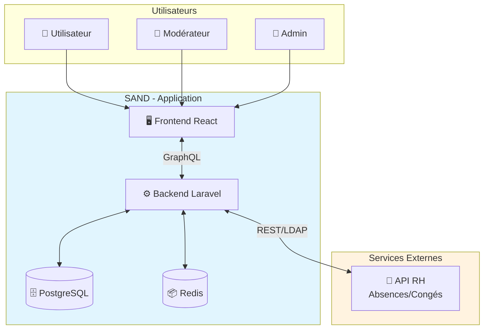
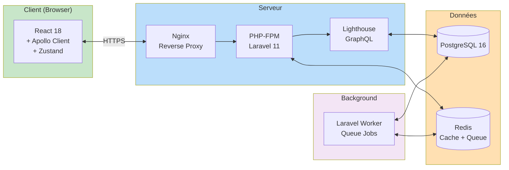
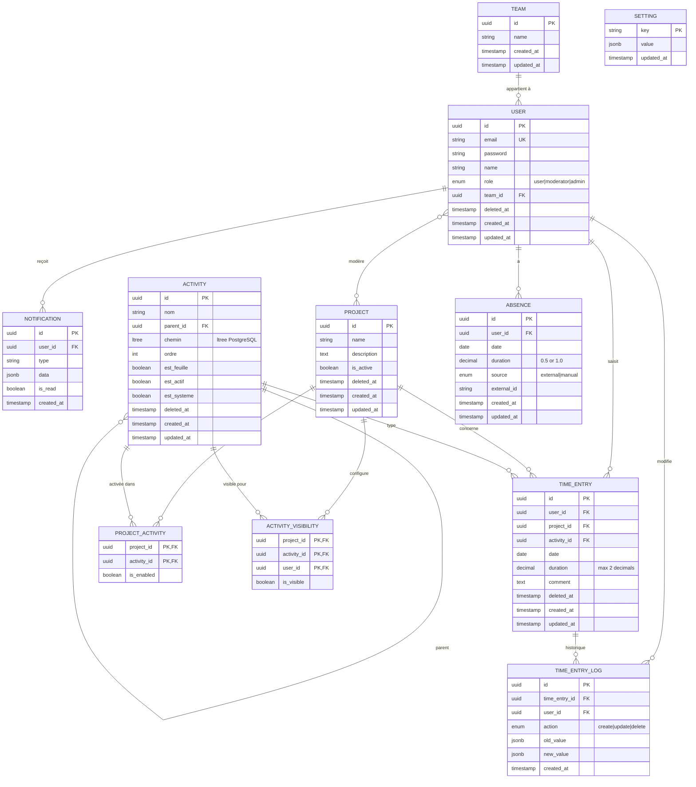
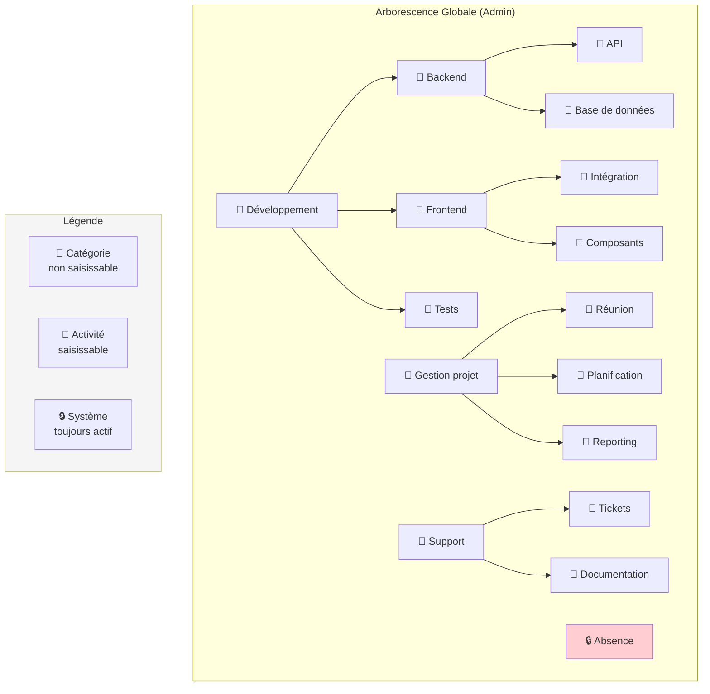
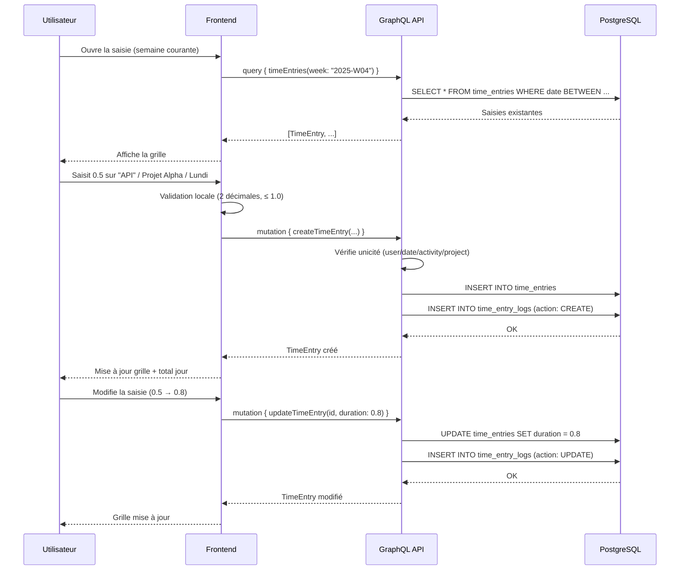
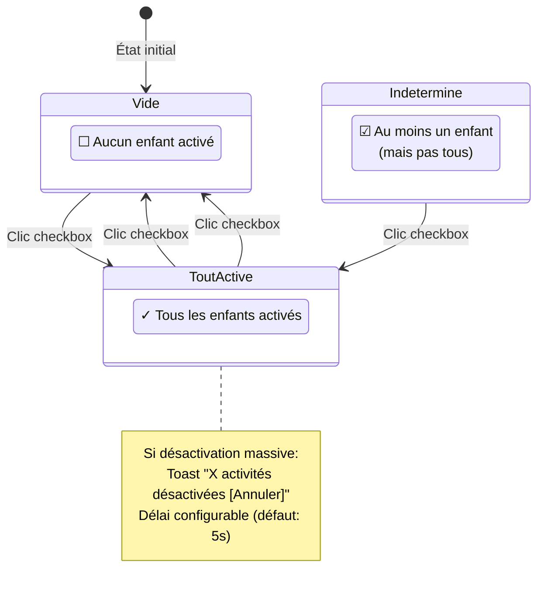
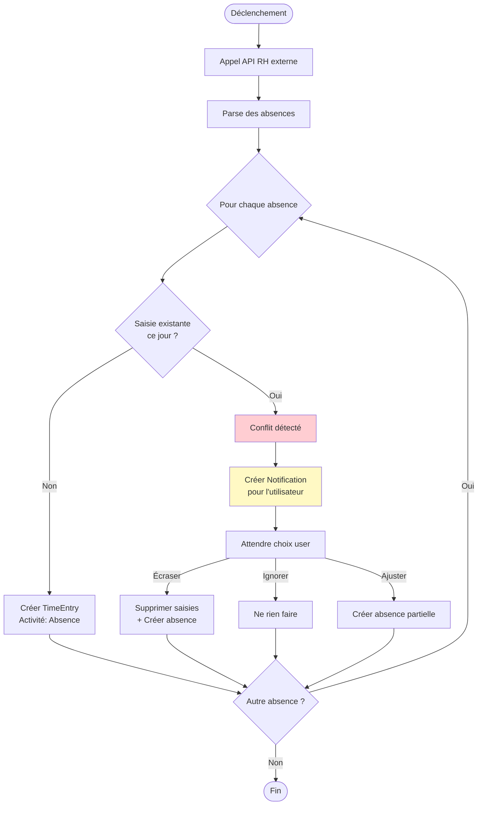
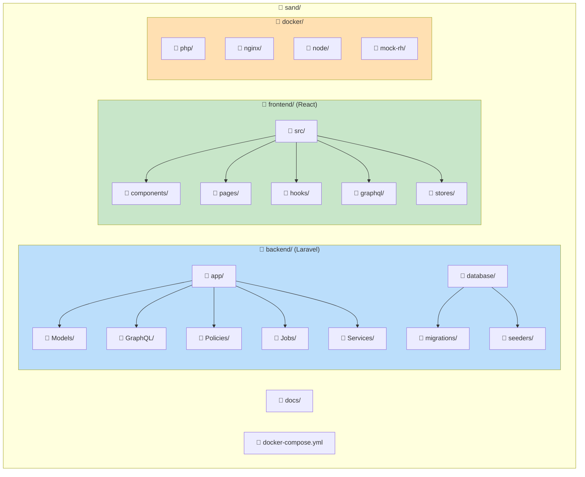
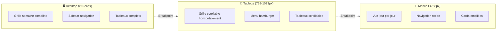

# SAND - Architecture

> Diagrammes au format Mermaid - rendus automatiquement sur GitHub/GitLab

---

## 1. Architecture générale (C4 - Contexte)

---

## 2. Architecture technique (C4 - Container)

---

## 3. Modèle de données (ERD)

---

## 4. Arborescence des activités

---

## 5. Flux de saisie hebdomadaire

---

## 6. Flux d'activation tri-state

---

## 7. Flux d'import des absences

---

## 8. Structure des dossiers

---

## 9. Responsive Design

---

*Document v1.1 - Janvier 2026*
*Mise à jour : type ltree pour l'arborescence des activités*
*Diagrammes Mermaid - Rendu natif GitHub/GitLab/VS Code*
