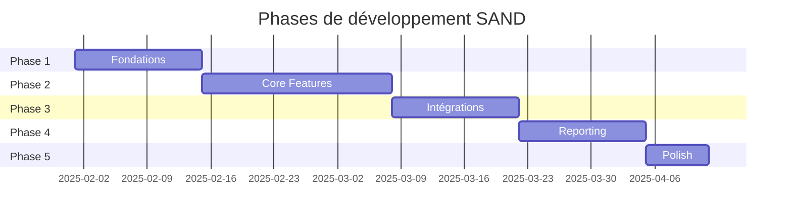

# SAND - Backlog

> Phases de développement et user stories

---

## Vue d'ensemble des phases

---

## Phase 1 - Fondations

### Objectif
Mettre en place l'infrastructure technique et l'authentification.

### User Stories

#### US-1.1 : Setup Docker
> **En tant que** développeur
> **Je veux** un environnement Docker fonctionnel
> **Afin de** pouvoir développer en local sans configuration manuelle

**Critères d'acceptation :**
- [ ] `docker-compose up` démarre tous les services
- [ ] Laravel accessible sur `localhost:8080`
- [ ] React (Vite) accessible sur `localhost:5173`
- [ ] PostgreSQL accessible sur `localhost:5432`
- [ ] Redis accessible sur `localhost:6379`

---

#### US-1.2 : Modèles et migrations
> **En tant que** développeur
> **Je veux** les modèles Eloquent et migrations
> **Afin d'** avoir la structure de base de données

**Critères d'acceptation :**
- [ ] Toutes les tables créées (voir 02_SPEC_TECHNIQUE.md)
- [ ] Relations Eloquent définies
- [ ] Soft delete sur User, Project, Activity, TimeEntry
- [ ] Index de performance ajoutés
- [ ] Seeder pour données de test

---

#### US-1.3 : Authentification
> **En tant qu'** utilisateur
> **Je veux** me connecter avec email/mot de passe
> **Afin d'** accéder à l'application

**Critères d'acceptation :**
- [ ] Sanctum SPA auth configuré
- [ ] Login/logout fonctionnels
- [ ] Protection CSRF active
- [ ] Rate limiting sur login (5/minute)
- [ ] Redirection si non authentifié

---

#### US-1.4 : Setup GraphQL
> **En tant que** développeur
> **Je veux** l'API GraphQL de base
> **Afin de** pouvoir requêter les données

**Critères d'acceptation :**
- [ ] Lighthouse installé et configuré
- [ ] Query `me` retourne l'utilisateur connecté
- [ ] GraphQL Playground accessible en dev
- [ ] Types de base définis (User, Team, Project, Activity)

---

#### US-1.5 : Setup Frontend React
> **En tant que** développeur
> **Je veux** le frontend React configuré
> **Afin de** pouvoir développer l'interface

**Critères d'acceptation :**
- [ ] Vite + React + TypeScript
- [ ] Apollo Client configuré
- [ ] Tailwind CSS installé
- [ ] Routing (React Router)
- [ ] Page de login fonctionnelle

---

## Phase 2 - Fonctionnalités Core

### Objectif
Implémenter la saisie des temps et l'administration.

### User Stories

#### US-2.1 : CRUD Utilisateurs ✅
> **En tant qu'** admin
> **Je veux** gérer les utilisateurs
> **Afin de** contrôler les accès

**Critères d'acceptation :**
- [x] Liste des utilisateurs avec recherche
- [x] Création d'utilisateur (email, nom, rôle, équipe)
- [x] Modification d'utilisateur
- [x] Suppression (soft delete)
- [x] Attribution des rôles (user/moderator/admin)

---

#### US-2.2 : CRUD Équipes ✅
> **En tant qu'** admin
> **Je veux** gérer les équipes
> **Afin d'** organiser les utilisateurs par service

**Critères d'acceptation :**
- [x] Liste des équipes
- [x] Création/modification/suppression
- [x] Voir les membres d'une équipe

---

#### US-2.3 : Gestion de l'arborescence des activités ✅
> **En tant qu'** admin
> **Je veux** gérer l'arborescence des activités
> **Afin de** définir les types de tâches disponibles

**Critères d'acceptation :**
- [x] Affichage en arbre avec chevrons pliables
- [x] Création d'activité (nom, parent)
- [x] Modification/suppression
- [x] Réorganisation par boutons monter/descendre
- [x] Path matérialisé mis à jour automatiquement
- [x] Activité "Absence" protégée (is_system)

---

#### US-2.4 : CRUD Projets avec activation tri-state ✅
> **En tant qu'** admin
> **Je veux** gérer les projets et leurs activités
> **Afin de** configurer ce qui est disponible pour chaque projet

**Critères d'acceptation :**
- [x] Liste des projets (actifs/archivés)
- [x] Création/modification projet (nom, description)
- [x] Archivage (soft delete)
- [x] Arbre des activités avec checkboxes tri-state
- [x] Cycle : vide → tout → vide
- [x] État indéterminé calculé automatiquement
- [x] Attribution des modérateurs (modale avec recherche)

---

#### US-2.5 : Toast d'annulation ✅
> **En tant qu'** admin
> **Je veux** pouvoir annuler une désactivation massive
> **Afin d'** éviter les erreurs

**Critères d'acceptation :**
- [x] Toast affiché après désactivation de >3 activités
- [x] Message "X activités désactivées [Annuler]"
- [x] Barre de progression (délai configurable)
- [x] Clic sur Annuler restaure l'état précédent
- [x] Délai par défaut : 5 secondes

---

#### US-2.6 : Visibilité par utilisateur ✅
> **En tant qu'** admin
> **Je veux** masquer certaines activités pour certains utilisateurs
> **Afin de** restreindre l'accès

**Critères d'acceptation :**
- [x] Modale "Restrictions de visibilité" dans page projets
- [x] Ajout de restriction (activité + utilisateur)
- [x] Suppression de restriction
- [x] Scope par projet (pas global)
- [x] Activités système (Absence) toujours visibles

---

#### US-2.7 : Interface de saisie hebdomadaire ✅
> **En tant qu'** utilisateur
> **Je veux** saisir mes temps sur une grille hebdomadaire
> **Afin de** déclarer mon activité

**Critères d'acceptation :**
- [x] Grille lundi-dimanche (7 jours)
- [x] Navigation entre semaines
- [x] Sélection projet → arborescence activités filtrée
- [x] Saisie par cellule (0.01 à 1.00)
- [x] Validation 2 décimales max
- [x] Total par jour affiché
- [x] Warning si total ≠ 1.0 (jour passé/présent)
- [x] Vue mobile responsive (cartes)

---

#### US-2.8 : Blocage semaines futures ✅
> **En tant qu'** utilisateur
> **Je veux** voir les semaines futures en lecture seule
> **Afin de** ne pas saisir par erreur

**Critères d'acceptation :**
- [x] Navigation vers semaines futures possible
- [x] Cellules en lecture seule (grisées)
- [x] Message explicatif affiché

---

#### US-2.9 : Unicité des saisies ✅
> **En tant que** système
> **Je veux** une seule ligne par user/date/activité/projet
> **Afin d'** éviter les doublons

**Critères d'acceptation :**
- [x] Contrainte unique en base
- [x] Mutation update si saisie existe
- [x] Mutation create sinon
- [x] Message d'erreur clair si conflit

---

#### US-2.10 : Historique des modifications ✅
> **En tant qu'** admin/modérateur
> **Je veux** voir l'historique des modifications
> **Afin de** tracer les changements

**Critères d'acceptation :**
- [x] Log créé à chaque create/update/delete
- [x] Stockage old_value/new_value en JSON
- [x] Affichage dans détail d'une saisie (modale historique timeline)
- [x] Qui a modifié + quand

---

## Phase 3 - Intégrations & Modération

### Objectif
Intégrer les absences et la modération.

### User Stories

#### US-3.1 : Mock service RH ✅
> **En tant que** développeur
> **Je veux** un service simulant l'API RH
> **Afin de** tester l'import des absences

**Critères d'acceptation :**
- [x] Container Docker dédié (`mock-rh` sur port 3001)
- [x] Endpoint GET /absences?user=X&start=Y&end=Z
- [x] Données configurables (JSON/seed) - matricules alignés avec SAND
- [ ] Simule authentification LDAP (mock) - non nécessaire pour v1

---

#### US-3.2 : Import des absences ✅
> **En tant qu'** utilisateur
> **Je veux** que mes congés soient importés automatiquement
> **Afin de** ne pas les saisir manuellement

**Critères d'acceptation :**
- [x] Mutation `syncAbsences`
- [x] Appel au service RH (mock) via `RhApiClient`
- [x] Création des absences en base (avec `reference_externe` pour idempotence)
- [x] Support absence partielle (0.5 ETP) via `duree_journaliere`
- [x] Détection des conflits avec saisies existantes
- [x] Notifications automatiques (import OK ou conflit)

---

#### US-3.3 : Gestion des conflits absences ✅
> **En tant qu'** utilisateur
> **Je veux** être prévenu en cas de conflit absence/saisie
> **Afin de** choisir comment le résoudre

**Critères d'acceptation :**
- [x] Détection conflit à l'import (fait dans US-3.2)
- [x] Notification créée (TYPE_CONFLIT_ABSENCE avec absence_id et saisie_ids)
- [x] Backend résolution (`resolveAbsenceConflict` mutation)
- [x] Interface de résolution (modale écraser/ignorer)
- [ ] Warning si total > 1.0 (hors scope v1, option AJUSTER masquée)

---

#### US-3.4 : Droits modérateur ✅
> **En tant que** modérateur
> **Je veux** voir et modifier les saisies de mon équipe
> **Afin de** corriger les erreurs

**Critères d'acceptation :**
- [x] Accès aux saisies des users de ses projets
- [x] Création de saisie pour un autre user
- [x] Modification de saisie
- [x] Suppression de saisie
- [x] Log de qui a modifié

---

#### US-3.5 : Page de supervision ✅
> **En tant que** modérateur/admin
> **Je veux** voir les anomalies de saisie
> **Afin de** les traiter

**Critères d'acceptation :**
- [x] Liste des anomalies (incomplet, dépassement, vide, conflit absence)
- [x] Filtres (projet, équipe, période, type)
- [x] Navigation par semaine
- [x] Groupement par utilisateur
- [x] Clic → accès à la saisie de l'utilisateur (navigation avec query params)
- [x] Modérateur : ses projets uniquement (via backend policy)
- [x] Admin : tous les projets

---

#### US-3.6 : Système de notifications ✅
> **En tant qu'** utilisateur
> **Je veux** recevoir des notifications
> **Afin d'** être informé des anomalies

**Critères d'acceptation :**
- [x] Icône cloche dans le header
- [x] Badge compteur (non lues)
- [x] Panneau latéral (slide-over) listant les notifications
- [x] Marquage lu/non lu (clic ou "Tout marquer lu")
- [x] Chargement au refresh + polling 60s (pas temps réel)

---

## Phase 4 - Reporting

### Objectif
Statistiques et exports.

### User Stories

#### US-4.1 : Dashboard statistiques ✅
> **En tant qu'** utilisateur
> **Je veux** voir mes statistiques
> **Afin de** suivre mon activité

**Critères d'acceptation :**
- [x] Total temps par période
- [x] Répartition par projet (graphique camembert)
- [x] Taux de complétion (jours complets)

---

#### US-4.2 : Stats projet (modérateur) ✅
> **En tant que** modérateur
> **Je veux** voir les stats de mes projets
> **Afin de** piloter l'activité

**Critères d'acceptation :**
- [x] Temps total par projet
- [x] Répartition par activité (camembert)
- [x] Répartition par utilisateur (barres horizontales)
- [x] Évolution mensuelle (courbe)

---

#### US-4.3 : Stats globales (admin) ✅
> **En tant qu'** admin
> **Je veux** voir les stats globales
> **Afin de** piloter l'organisation

**Critères d'acceptation :**
- [x] Vue tous projets (répartition camembert)
- [x] Vue par équipe (filtre select)
- [x] Filtres période (navigation mois)
- [x] Comparatif entre périodes (deltas M vs M-1 sur KPI)

---

#### US-4.4 : Export CSV asynchrone ✅
> **En tant qu'** admin
> **Je veux** exporter les données en CSV
> **Afin de** faire des analyses externes

**Critères d'acceptation :**
- [x] Bouton "Exporter"
- [x] Sélection filtres (période, projet, équipe)
- [x] Job asynchrone lancé (ExportTimeEntriesJob)
- [x] Notification quand prêt (TYPE_EXPORT_PRET)
- [x] Lien de téléchargement (expire après 24h)

---

#### US-4.5 : Configuration système ✅
> **En tant qu'** admin
> **Je veux** configurer les paramètres système
> **Afin de** personnaliser l'application

**Critères d'acceptation :**
- [x] Page Config. Système (/admin/configuration)
- [x] Délai d'annulation (undo)
- [x] Affichage weekends
- [x] Premier jour de semaine
- [x] Sauvegarde en base (settings)

---

## Phase 5 - Polish

### Objectif
Finalisation et qualité.

### User Stories

#### US-5.1 : Responsive design ✅
> **En tant qu'** utilisateur mobile
> **Je veux** utiliser l'app sur téléphone
> **Afin de** saisir en déplacement

**Critères d'acceptation :**
- [x] Breakpoints Tailwind (sm, md, lg)
- [x] Mobile : vue jour par jour (GrilleSemaineMobile)
- [x] Tablette : grille scrollable
- [x] Menu hamburger sur petit écran
- [x] NavAdmin scrollable sur mobile
- [x] Tables admin responsives (colonnes cachees sur xs)

---

#### US-5.2 : Tests backend ✅
> **En tant que** développeur
> **Je veux** des tests automatisés
> **Afin de** garantir la qualité

**Critères d'acceptation :**
- [x] Tests unitaires (Models, Policies) - 33 tests
- [x] Tests Feature (GraphQL mutations) - 86 tests
- [x] Tests Policy (autorisations) - 20 tests
- [x] 119 tests, 504 assertions, 0 echecs

**Bonus** : Les tests ont revele 6 bugs applicatifs reels (voir DIFFUSION_LOG.md Phase 5)

---

#### US-5.3 : Tests frontend ✅
> **En tant que** développeur
> **Je veux** des tests frontend
> **Afin de** garantir l'UI

**Critères d'acceptation :**
- [x] Tests composants (Vitest) - CelluleSaisie, NavigationSemaine, TotauxJournaliers
- [x] Tests stores Zustand - authStore, saisieStore, notificationStore
- [x] Tests utilitaires - semaineUtils
- [x] 66 tests, 0 echecs

---

#### US-5.4 : Documentation API ✅
> **En tant que** développeur
> **Je veux** une documentation API
> **Afin de** faciliter le développement

**Critères d'acceptation :**
- [x] GraphiQL accessible (/graphiql en dev)
- [x] Descriptions sur tous les types/champs (11 types, 8 inputs, 7 enums)
- [x] Descriptions sur tous les arguments de queries et mutations

---

#### US-5.5 : Optimisations performance ✅
> **En tant qu'** utilisateur
> **Je veux** une app rapide
> **Afin d'** avoir une bonne expérience

**Critères d'acceptation :**
- [x] Cache arborescence activites (@cache TTL 5 min)
- [x] Lazy loading composants React (React.lazy + Suspense)
- [x] Pagination sur la liste des utilisateurs (Precedent/Suivant)
- [x] Correction N+1 queries dans StatistiquesQuery (whereIn)
- [x] TypePolicies Apollo (keyFields sur 8 types)

---

## Évolutions futures (hors scope v1)

| Feature | Description |
|---------|-------------|
| LDAP/SSO | Authentification entreprise |
| Mobile app | React Native |
| Notifications push | Rappel de saisie hebdo |
| Calendrier | Import Outlook/Google |
| PWA | Mode hors-ligne |
| Multi-org | Plusieurs instances/organisations |

---

*Document v1.0 - Janvier 2025*
